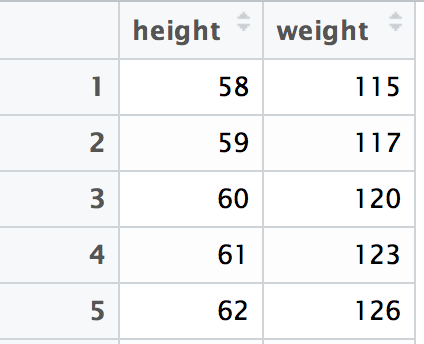
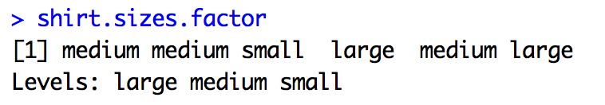
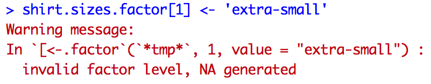

# Module 8: Introduction to Data Frames

## Overview
In this module, we'll begin working with data frame objects, which are the primary data storage type used in R. In many ways, data frames are similar to a two-dimensional row/column layout that you should be familiar with from spreadsheet programs like Microsoft Excel. This module will cover various ways of creating Data frames, and describe how they are related to other data types in R.

<!-- START doctoc generated TOC please keep comment here to allow auto update -->
<!-- DON'T EDIT THIS SECTION, INSTEAD RE-RUN doctoc TO UPDATE -->
**Contents**

- [Resources](#resources)
- [Lists](#lists)
- [Data Frames](#data-frames)
  - [Creating Data Frames](#creating-data-frames)
  - [Describing Dataframes](#describing-dataframes)
  - [Accessing Data in Data Frames](#accessing-data-in-data-frames)
- [Reading CSV Data](#reading-csv-data)
  - [Factor Variables](#factor-variables)

<!-- END doctoc generated TOC please keep comment here to allow auto update -->

## Resources
- [Intro to Lists - R Tutor](http://www.r-tutor.com/r-introduction/list)
- [List Basics - R Bloggers](https://www.r-bloggers.com/basics-of-lists/)
- [Single v.s. double brackets - StackOverflow](http://stackoverflow.com/questions/1169456/in-r-what-is-the-difference-between-the-and-notations-for-accessing-the)
- [Factor Variables -  UCLA](http://www.ats.ucla.edu/stat/r/modules/factor_variables.htm)
- [Data Frame Indexing - R Tutor](http://www.r-tutor.com/r-introduction/data-frame/data-frame-row-slice)

## Lists
Before we learn about data frames, we need to understand a bit more about the **list** variable type. This is because data frames are actually a list object with class `data.frame`, which gives them special properties. Similarly to a vector, a list is a collection of elements. However, you can store **elements of different types** in a list. A list is easily constructed by passing elements as **arguments** to the `list` function:

```r
# Create a list with three elements in it
my.list <- list(1, '2', TRUE)
```

This creates a list with three elements in it. To retrieve elements from a list, you use the **double-bracket notation**:

```r
# Create a list with three elements in it
my.list <- list(1, '2', TRUE)

# Retrieve the second element from the list
my.list[[2]]  # returns '2'
```
The double-brackets are used because single-brackets **return a list**, which is likely not what you're intending ([more info](http://stackoverflow.com/questions/1169456/in-r-what-is-the-difference-between-the-and-notations-for-accessing-the)).

While you can access list elements based on their position, you can also assign names to each element in a list, making your code much more clear:

```r
# Create a variable `person1` and store some information in that variable
person1 <- list(name = "Miriam", favorite.band = "Red Baraat")
```

We can now access information about our list `person1` using the **name of the element** we're interested in, rather than the index (which tells us no information):

```r
# Retrieve information about `person1`
name <- person1$name  # `$` notation

# Retrieve information about `person1`
name <- person1[['name']]  # using double brackets and element name
```

Both of these approaches are more clear, enhancing code readability (and writability, for that matter). For practice working with lists, see [exercise-1](exercise-1).

## Data Frames
As stated above, data frames are really just lists with some additional properties that make them well suited for working with data. More specifically, data frames are lists in which each element is a **vector of the same length**. To relate this to the familiar row/column layout of a 2-dimensional table, each _vector_ in your data frame is a _column_ of your table. For example, consider the following table of weights and heights:



You can think of this as a **list** of two **vectors**: `height` and `weight`. It makes sense that the vectors are **columns, not rows**, because a row of data may contain elements of different types (and vectors are collections of elements all of the same type).

### Creating Data Frames
While this is not how you will typically work with data, it's important to understand that you can construct a data frame by combining multiple vectors. To accomplish this, you can use the `data.frame` function, which accepts **vectors as arguments**, and creates a column for each vector. For example:

```r
# Vector of heights
height <- 58:62

# Vector of weights
weight <- c(115, 117, 120, 123, 126)

# Combine the vectors into a data.frame
my.data <- data.frame(height, weight)
```

Because data frame elements are lists, we can access the values from `my.data` using the same syntax as above:

```r
# Using the same weights/heights as above:
my.data <- data.frame(height, weight)

# Retrieve weights
my.weights <- my.data$weight

# Retrieve heights
my.heights <- my.data[['height']]
```

### Describing Dataframes
Here are a few ways in which you can start to explore you data frame elements:

| Function | Result |
| :------------- | :------------- |
| `nrow(my.data.frame)`       | Number of rows in the data frame       |
| `ncol(my.data.frame)`       | Number of columns in the data frame       |
| `dim(my.data.frame)`        | Dimensions (rows, columns) in the data frame       |
| `colnames(my.data.frame)`   | Column names of the data frame |
| `rownames(my.data.frame)`   | Row names of the data frame|
| `head(my.data.frame)`       | Prints the top subset of rows of the data frame       |
| `tail(my.data.frame)`       | Prints the last subset of rows of the data frame       |
| `View(my.data.frame)`       | Opens up the RStudio data frame viewer (only in RStudio)|

### Accessing Data in Data Frames
There are a variety of approaches for retrieving desired information from within data frames. While we'll begin to use other R packages for data frame manipulation, it's crucial to understand the built in approaches for accessing specific cells within a data frame.

The section above already covered methods for retrieving data frame columns using the double-bracket (`data[['col.name']]`) and dollar sign (`data$col.name`) methods. Below is a table of additional methods for retrieving individual cells, or rows from a data frame.

| Syntax         |    Example     |    Result      |
| :------------- | :------------- | :------------- |
| `data[row.num, col.num]` | `data[2,3]` | Retrieve element in the second row, third column |
| `data[row.num, col.name]` | `data[2,'height']` | Retrieve second element in the `height` column |
| `data[row.name, col.name]` | `data['steve','height']` | Retrieve the `height` of row named `steve`|
| `data[row.num, ]` | `data[2,]`                 | Retrieve all columns and only the second row |
| `data[row.nums, ]` | `data[2:4,]`                 | Retrieve all columns and the second through fourth rows |
| `data[, col.name]`| `data[,'height']`  | Retrieve all rows and only the `height` column |

For practice retrieving information and manipulating data frames, see [exercise-2](exercise-2) and [exercise-3](exercise-3).

## Reading CSV Data
While R is equipped to ingest a variety of different forms of data, in this module we'll focus on reading in tabular data in **comma separated value** (csv) format. Most spreadsheet programs like Microsoft Excel, Numbers, or Google Sheets are simply interfaces for formatting and interacting with data that is saved in a format like `.csv` files. These programs easily import and export `.csv` files, however `.csv` files are unable to save the formatting done in those programs (the files only store the data, separated by commas).

Reading in `.csv` data is simple using the `read.csv` function:

```r
# Read your data into a data frame `my.data`
my.data <- read.csv('file_name.csv')
```

By default, `read.csv` will return a data frame of the dataset. This is almost ready to use out of the box, but first we need to understand how the function treats **factor** variables.

### Factor Variables
Factor variables are variables that consist of a finite set of categories (i.e., they are **categorical variables**). Imagine that you had a vector of shirt sizes which could only take on the values `small`, `medium`, or `large`. If you were working with a large dataset, it would end up taking up a lot of memory to store the character strings for each one of those variables. However, you could create a **factor variable** that stores _integers instead of strings_, and keeps track of the relationship between the integers and their **labels**. For example:

```r
# Start with a character vector of shirt sizes
shirt.sizes <- c('small', 'medium', 'small', 'large', 'medium', 'large')

# Convert to a vector of factor data
shirt.sizes.factor <- as.factor(shirt.sizes)
```

When you print out the `shirt.sizes.factor` variable, R still (intelligently) prints out the **labels** that you are presumably interested in. It also indicates the **levels**, which are the _only_ possible values that elements can take on.



As you can see, if you attempt to assign a new value, R will assign it `NA` and produce an error message:



All of this is to say, when you use the `read.csv` function, it will **interpret strings as factors by default**. This is good for memory and various statistical analyses, but it will likely confuse your data processing. As a results, make sure to specify the following argument in your `read.csv` function:

```r
# Read in data file, making sure character variables are not factors
my.data <- read.csv('file_name.csv', stringsAsFactors = FALSE)
```

For practice reading and working with data, see [exercise-4](exercise-4) and [exercise-5](exercise-5).
